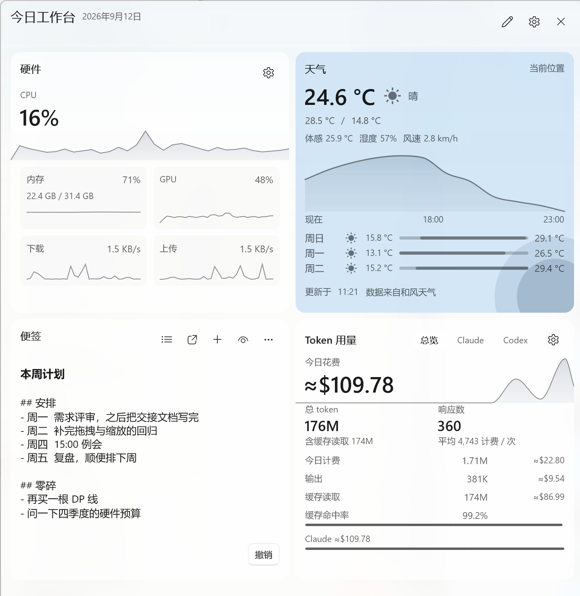

<div align="center">

# WinWidgetBoard

**一块住在 Windows 11 任务栏里的本地优先工作台。**

[](https://github.com/CookPiu/WinWidgetBoard/actions/workflows/build.yml)
[](LICENSE)
[](#运行要求)
[](https://github.com/CookPiu/WinWidgetBoard/releases)

[English](README.md) | 简体中文



</div>

自己的入口坐在任务栏条带上，点开是一块原生半屏面板，承载便签、天气、本机硬件读数与 AI Token 用量。
数据全部留在本地，无账号；除非你打开的卡片自身需要，否则不向任何地方发送数据。

它**不注入** `explorer.exe`，不挂钩 Shell，也不读取 Explorer 的私有 XAML 树。入口是应用自有的普通
Win32 窗口，位置由公开几何推导；几何无法确认时宁可隐藏或降级，也不猜测。

> 中英文界面随包提供，面板跟随 Windows 显示语言；英文界面的截图见 [English README](README.md)。

## 能力


入口本身就是一块可读的信息条，而不只是一个按钮——一枚胶囊显示天气，另一枚（可关闭）显示实时硬件读数。

| 能力 | 说明 |
| --- | --- |
| **任务栏入口** | 嵌入任务栏条带的原生 C++/Win32 信息条。对齐方式、显示内容、硬件胶囊开关与快捷键（四个预设加自定义录制）均可配置。 |
| **面板** | WinUI 3、Desktop Acrylic、系统强调色层级。关闭改为隐藏并常驻进程，重开在数十毫秒量级，不再有冷启动。 |
| **响应式布局** | 逻辑 2/4/6 列网格。编辑会话内可拖动、调整尺寸、增删卡片，撤销/重做 20 步。持久化的是顺序与尺寸档，**不是屏幕像素**，因此换分辨率或 DPI 后布局仍然成立。 |
| **便签** | 本地 CRUD、搜索、Markdown 预览、自动保存；保存失败时保留内存草稿而非丢弃输入。 |
| **天气** | 当前天气取自 **Open-Meteo**（默认，免账号）或**和风天气**（用户自备 API Host 与 Key）。位置来自 Windows 设备定位（前台授权）或手动搜索。公制/英制是显示设置。 |
| **硬件监控** | 9 项读数来自公开用户态 API（PDH 计数器；本产品不分发也不加载任何内核驱动）。温度与风扇在 **HWiNFO** 或 **Core Temp** 运行时由其共享内存补齐；没有来源覆盖的读数直接不显示，而不是显示 0。 |
| **Token 用量** | 只读扫描 **Claude Code** 与 **Codex** 的本机会话记录，显示当日花费、每小时花费曲线、计费/输出/缓存 token 与缓存命中率。金额按公开 API 价折算并标 `≈`。转录内容不进日志、不落库。 |

### 不在范围内

计时器、待办、剪贴板历史、日历、第三方插件、账号、云同步和遥测均为**刻意延期**
（[ADR-0022](docs/adr/0022-lightweight-core-strategy.md)）。代码树中已有的占位卡片只是布局填充，
不会继续增加业务行为。这类请求会得到一个答复和一条链接，而不是静默排队——见
[CONTRIBUTING.md](CONTRIBUTING.md#scope-read-this-before-writing-code)。

## 隐私

- 便签、布局、天气位置与各项设置保存在 `%LOCALAPPDATA%\WinWidgetBoard` 下的 SQLite 数据库。无账号、无云同步。
- **无遥测**。除非你启用的能力自身需要，不向任何地方发送数据。
- 出站流量仅限：所选天气数据源的端点；以及在你保留每日价表同步时，`raw.githubusercontent.com` 上的 LiteLLM 公开价表。
- 地点搜索词是唯一离开本机的用户输入文本，且仅在你提交搜索时发送。
- 天气载荷从不落库，只存在于 broker 进程内。
- 和风天气 API Key 是本产品唯一的用户凭据：DPAPI 加密落库，只以请求头发往白名单内的厂商域名，不进 URL、不进日志，经 IPC 只写不读。
- 会话转录只读，不复制、不存储、不外发。

详见 [docs/09-security-privacy.md](docs/09-security-privacy.md)。

## 运行要求

- Windows 11 x64，build 22000 及以上。更早的任务栏不是支持目标——入口拒绝嵌入，改用工作区内的安全槽位。
- [.NET 10 桌面运行时（x64）](https://dotnet.microsoft.com/download/dotnet/10.0)。两个托管进程为
  framework-dependent；Windows App SDK 已自包含随附，无需另装。
- 可选：运行中的 HWiNFO 或 Core Temp，用于温度与风扇读数。
- 普通用户权限。不提权、不装服务、不装驱动、不写注册表类。

## 安装

从 [Releases](https://github.com/CookPiu/WinWidgetBoard/releases) 下载 zip，解压到任意位置，运行
`WinWidgetBoard.LauncherHost.exe`。它会自行拉起面板与 broker。

> 发布产物**未做代码签名**，首次运行会出现 SmartScreen 提示。若你在意，请对照 Release 页面上的
> SHA-256 校验下载，或自行从源码构建。

包内另附 `LICENSE`、[`THIRD-PARTY-NOTICES.md`](THIRD-PARTY-NOTICES.md)（随包分发的全部 Microsoft
产物及其适用条款）与 `sbom.cdx.json`——一份 CycloneDX 物料清单，由装配完成的产物生成而非由仓库引用推导。

卸载：从入口右键菜单选「退出」，删除该目录；若同时要清除数据，再删除 `%LOCALAPPDATA%\WinWidgetBoard`。

## 从源码构建

先决条件是刻意锁定的，完整基线与每个锁定值的理由见
[docs/development/toolchain.md](docs/development/toolchain.md)。简版：Visual Studio 2026 的 C++ 桌面
开发工作负载（MSVC v143、Windows SDK `10.0.26100.0`），以及 .NET SDK `10.0.302`——由 `global.json`
以 `rollForward: disable` 锁定。

```powershell
dotnet restore .\WinWidgetBoard.sln

# 在 Visual Studio Developer PowerShell 中执行
msbuild .\WinWidgetBoard.sln /m /p:Configuration=Release /p:Platform=x64

dotnet test .\tests\UnitTests\WinWidgetBoard.UnitTests.csproj -c Release --no-build --property:Platform=x64
```

把自己的构建装成日常可用：

```powershell
.\scripts\Install-WinWidgetBoard.ps1
```

三个可执行文件都能在无桌面会话下自检——入口与面板的 `--smoke-test`、broker 的
`--pipe-handshake-smoke-test`，成功退出码为 0。CI 跑的就是它们。分项目构建命令、C++ 与 C# 项目之间的
输出路径陷阱，以及真实桌面 UIA 脚本，见 [CONTRIBUTING.md](CONTRIBUTING.md)。

## 架构

三个进程加两个共享库。进程拆分是承重结构而非组织方式：常驻入口不得携带 UI 或网络运行时，面板不得直接碰数据库。

```
User -> LauncherHost (C++/Win32)  --spawns-->  WorkspacePanel (C#/WinUI 3)
             |                                        |
             +---- minimal native pipe client --------+ CoreBroker.Client (typed clients)
                                                      |
                                             CoreBroker (C# worker)
                                                 +-- SQLite (winsqlite3.dll)
                                                 +-- weather / pricing over HTTPS
```

三者经当前用户 Named Pipe 通信：4 字节长度前缀加 UTF-8 JSON，上限 1 MiB 且在分配前拒绝，
`session.hello` 是每个业务方法的前置门。每次写入携带 `clientOperationId`，重试重放首次结果而不是重复应用；
每个域有自己的并发令牌与冲突码。

设计理由见 [docs/03-technical-architecture.md](docs/03-technical-architecture.md)，
线协议见 [docs/07-api-contracts.md](docs/07-api-contracts.md)。

## 当前状态

1.0 之前，单人维护，持续开发中。上述七项能力均已实现并跑通完整链路，但验证目前只来自一台参考机——
[docs/08-testing-strategy.md](docs/08-testing-strategy.md) 中的完整显示矩阵（多显示器、100–200% DPI、
高对比度、文本缩放）与多设备性能门禁尚未执行。如果它在与那台机器不同的环境上表现异常，
那正是本项目最需要的缺陷报告。

当前事实、已知债务与下一步：[docs/status/implementation-status.md](docs/status/implementation-status.md)。

## 文档

全部设计文档为中文，索引在 [docs/README.md](docs/README.md)。想知道某处为什么这样设计，
先看 [ADR 索引](docs/adr/README.md)——每个高成本决策都有一条，包括那些被否掉的方案。

## 参与贡献

先读 [CONTRIBUTING.md](CONTRIBUTING.md)：它开篇就是「不会被合并的改动」，然后才是风险分级验证规则和
那些踩过才知道的构建陷阱。安全问题走 [SECURITY.md](SECURITY.md)，不要提到 issue 里。

## 致谢

本项目不内嵌任何第三方源码或资源，但运行时确实依赖他人的工作，且每一项都可选或可替换：

- [Open-Meteo](https://open-meteo.com)——免费、免账号的天气与地理编码，默认数据源。
- [和风天气 QWeather](https://dev.qweather.com)——第二个天气数据源，面向第一个数据源无法到达的网络。
- [HWiNFO](https://www.hwinfo.com) 与 [Core Temp](https://www.alcpu.com/CoreTemp/)——温度与风扇读数，
  经由它们发布的共享内存获取。WinWidgetBoard 只读，不分发任何驱动。
- [LiteLLM](https://github.com/BerriAI/litellm)——用于折算 Token 花费的公开模型价表。每日同步，可关闭。

## 许可证

[MIT](LICENSE)——决定与其附带的依赖约束见
[ADR-0039](docs/adr/0039-mit-license-and-public-repository.md)。
