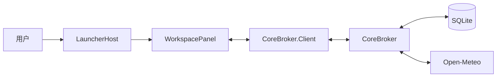

# WinWidgetBoard 当前技术架构

文档状态：已批准
版本：0.2
日期：2026-08-15

## 1. 架构目标

当前架构只服务入口、面板、基础布局、便签和天气。核心目标是：

- 入口常驻路径尽可能小；
- 面板按需运行；
- 用户数据本地保存；
- 网络天气与本地便签相互隔离；
- 不使用 Explorer 私有接口；
- 不再为延期功能增加平台级结构。

## 2. 当前组件



| 组件 | 技术 | 当前职责 |
| --- | --- | --- |
| `LauncherHost` | C++/Win32 | 入口窗口、公开几何、输入、面板启动 |
| `WorkspacePanel` | C#/.NET 10/WinUI 3 | 面板、布局、便签、天气和设置 UI |
| `CoreBroker.Client` | C# | 面向 UI 的高层 Named Pipe 客户端 |
| `CoreBroker` | C# Worker | SQLite、IPC、天气 Provider 和调度 |
| `Contracts` | C# / JSON | Envelope、DTO、限制和协议版本 |

`PluginHost`、独立卡片 SDK、云同步进程和硬件服务不属于当前架构。

## 3. 不可改变的边界

### LauncherHost

- 不引用 WinUI、SQLite、HTTP 或托管 UI 运行时；
- 不包含卡片业务；
- 不注入、Hook 或读取 Explorer 私有 XAML；只读取用户级任务栏对齐设置；
- 入口偏好（对齐、左对齐回退、显示内容）存放在 `HKCU\Software\WinWidgetBoard\Launcher`，
  因为入口必须先于 Broker 连接完成定位；用户数据仍只由 CoreBroker 持有；
- 几何不明确时安全隐藏或降级。

### WorkspacePanel

- 不直接打开 SQLite；
- 不手工拼装低层 Envelope；
- XAML code-behind 只负责视图事件、焦点和协调；
- 新业务状态进入 ViewModel、服务或现有运行时类型。

### CoreBroker

- 不引用 WinUI；
- 验证全部 IPC 输入；
- 持有数据库、天气网络访问和集中调度；
- 队列、重试、超时和释放必须有上界。

## 4. 启动与显示

1. LauncherHost 根据显示器和工作区矩形计算入口位置。
2. 用户释放点击后，LauncherHost 启动或激活 WorkspacePanel。
3. WorkspacePanel 先显示本地 UI，再连接 CoreBroker。
4. Broker 不可用时显示不可用状态，不阻止面板创建。
5. 面板通过入口、`Esc` 或安全失焦规则关闭。

当前只要求在一个明确的 Windows 11 x64 参考环境中保持可靠。完整多显示器和 DPI 矩阵留到发布候选。

## 5. IPC

- Windows Named Pipe；
- 当前用户 ACL；
- 4 字节 little-endian 长度头；
- UTF-8 JSON；
- 单消息最大 1 MiB；
- 协议版本 `1.0`；
- `session.hello` 完成前拒绝业务方法；
- 请求、响应和 `cards.snapshot` 事件共用有序写入；
- 断线后客户端重新握手和订阅。

当前业务方法只覆盖：

- 会话与心跳；
- 面板可见性；
- 布局读取和保存；
- 便签 CRUD 与搜索；
- 卡片快照订阅；
- 天气位置读取和保存。

详细约束见 [07-api-contracts.md](07-api-contracts.md)。

## 6. 持久化

CoreBroker 使用 Windows 系统 `winsqlite3.dll`。当前数据库保存：

- schema migrations；
- 布局；
- 便签；
- 天气位置设置。

规则：

- migration 在事务中执行；
- 破坏性升级前保留备份恢复路径；
- 更新和删除使用 revision 或时间戳冲突保护；
- LauncherHost 不读取数据库，只使用自己的注册表偏好；
- 天气 payload 不写入 SQLite；
- 验收数据库只能位于系统临时目录的隔离子目录。

## 7. 布局

布局使用 2/4/6 列逻辑网格，保存顺序、跨度和可选逻辑行列，不保存屏幕像素。

现有能力包括：

- 确定性 first-fit；
- 无重叠和越界保护；
- 显式编辑模式；
- 1:1 指针拖动；
- 保存和重放；
- 20 步撤销/重做。

这些能力进入维护状态。当前不继续增加自由像素布局、多套布局、复杂阻力和装饰性让位动画。

## 8. 便签

数据流：

```text
WorkspacePanel
  -> NoteEditorViewModel
  -> CoreBrokerNotesClient
  -> notes.* IPC
  -> NoteRepository
  -> SQLite
```

便签支持本地 CRUD、搜索、基础 Markdown、自动保存、显式重试和 revision 冲突保护。

不增加知识库、协作、双向链接、版本历史和回收站平台。

## 9. 天气

数据流：

```text
OpenMeteoWeatherProvider
  -> ProviderRefreshScheduler
  -> ProviderCardSnapshotAdapter
  -> cards.snapshot
  -> CardSnapshotDispatcher
  -> Weather card
```

位置设置流：

```text
WeatherSettingsDialog
  -> WeatherSettingsViewModel
  -> CoreBrokerWeatherSettingsClient
  -> weather.settings.*
  -> WeatherSettingsRepository
  -> WeatherProviderRuntime
```

天气只请求当前显示所需字段。位置标签和坐标写入 SQLite；天气 payload 只保留在当前 Broker 进程内。

自动定位、城市搜索、多天气实例和跨重启天气缓存延期。

## 10. 复杂度预算

- 不新增进程或项目，除非现有边界无法安全承载已批准核心需求。
- 不为只有一个实现的能力建立插件式工厂、扩展市场或通用权限框架。
- 新功能若需要跨越超过现有五层，应先判断是否超出轻量范围。
- 不继续扩大 `MainWindow.xaml.cs` 和 `ProviderRefreshScheduler.cs` 的职责。
- 新增 UI 行为优先从 `MainWindow` 提取协调器；新增命令进入对应领域 handler，路由器只做分发。
- UIA 公共操作应进入一个共享辅助模块，不在每个脚本复制。

## 11. 构建输出

- 标准输出位于仓库 `artifacts/`，不提交 Git；
- 因进程锁需要隔离输出时，优先使用系统临时目录；
- 不创建 `test-build-final`、`order-fix-final` 等永久累积目录；
- 验证结束后删除可重建输出；
- 仓库内 NuGet 缓存只保留当前锁文件需要的版本。

## 12. 当前技术债务

| 区域 | 问题 | 处理方向 |
| --- | --- | --- |
| `MainWindow.xaml.cs` | 同时协调布局、便签、订阅、动效和拖动 | 按行为提取协调器 |
| `ProviderRefreshScheduler.cs` | 单文件状态机过大 | 保持行为不变后分解内部职责 |
| `scripts/Test-*.ps1` | UIA 基础函数重复 | 提取共享模块 |
| 文档 | 历史和当前状态重复 | Git 保存历史，状态页只写当前事实 |

重构必须保持现有行为，不借机增加新卡片或新平台能力。

## 13. 延期架构

以下内容没有当前实现承诺：

- PluginHost 和第三方插件安全沙箱；
- 云账号和同步 Provider；
- 剪贴板、日历、待办、计时器、系统监控业务；
- 高级硬件服务；
- 自动更新、企业部署和多发布通道。

未来重新启用时必须新建范围决策，不得把旧提案直接当成当前设计。
