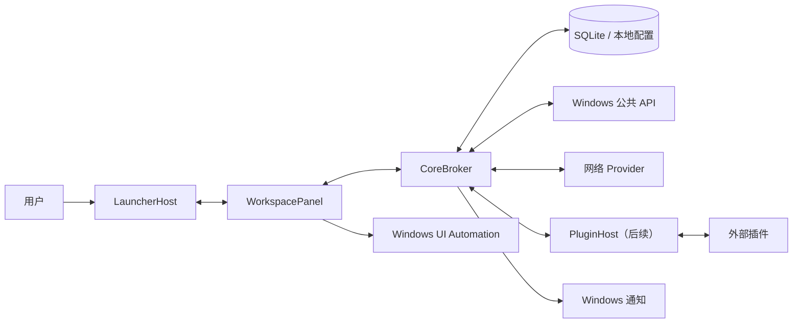
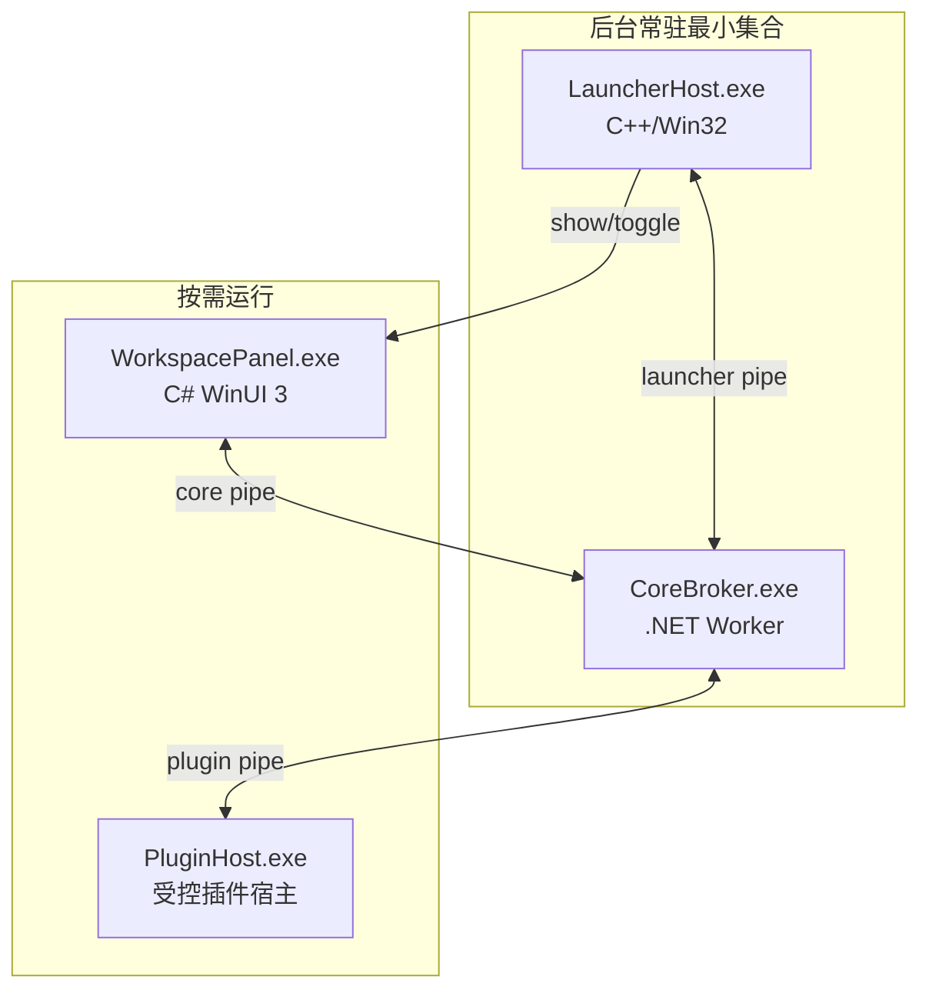

# WinWidgetBoard 技术架构

文档状态：已批准基线
版本：0.1
日期：2026-08-06

## 1. 架构驱动因素

本架构由以下约束驱动：

1. 任务栏入口必须稳定，不依赖 Explorer 私有 XAML。
2. 面板需要原生 Windows 视觉、复杂输入、无障碍和高质量动效。
3. 面板关闭时不得让完整 UI 框架持续占用后台资源。
4. 计时器、通知和数据 Provider 需要脱离面板继续运行。
5. 第三方扩展不得把不可信代码加载进 LauncherHost 或 WorkspacePanel。
6. 剪贴板、账号、日历和插件具有高隐私与安全风险。
7. Windows 更新、Explorer 重启、显示器变化和 DPI 必须可恢复。
8. 架构必须便于 Luna 按小里程碑实施和验证。

## 2. 核心决策摘要

| 编号 | 决策 |
| --- | --- |
| A-001 | 稳定版使用独立任务栏覆盖按钮，不注入 Explorer |
| A-002 | LauncherHost 使用原生 C++/Win32 |
| A-003 | WorkspacePanel 使用 C#/.NET 10/WinUI 3 |
| A-004 | CoreBroker 独立于 UI，负责数据、存储、调度和通知 |
| A-005 | IPC 使用当前用户可访问的命名管道和长度前缀 JSON |
| A-006 | MVP 只包含内置可信卡片，第三方插件安装推迟 |
| A-007 | 布局使用跨度和顺序持久化，不存绝对像素 |
| A-008 | SQLite 存用户内容；引导所需最小配置使用原子 JSON |
| A-009 | 剪贴板正文默认不进入应用数据库 |
| A-010 | 云同步以 Provider 形式后加，本地数据始终可独立工作 |

完整理由参见 `docs/adr/`。

## 3. 系统上下文



## 4. 进程架构



### 4.1 LauncherHost

职责：

- 创建和维护任务栏入口窗口；
- 计算入口安全位置；
- 处理点击、右键和快捷键；
- 监听 Explorer、显示器、DPI、电源和全屏状态；
- 启动或激活 WorkspacePanel；
- 展示最小状态徽标；
- 在无法确认位置时安全隐藏。

不得承担：

- 卡片业务逻辑；
- 网络访问；
- SQLite；
- 账号；
- 插件执行；
- 高级硬件采样；
- 大型图片解码。

### 4.2 WorkspacePanel

职责：

- 半屏窗口和设置窗口；
- 卡片网格、编辑、拖动、缩放；
- 内置卡片视图和 ViewModel；
- UI Automation；
- 主题、材质和 Composition 动效；
- 从 CoreBroker 订阅状态；
- 将用户命令提交给 CoreBroker。

生命周期：

- 首次打开按需启动；
- 关闭后可保温 120 秒；
- 保温期间停止不可见 UI 动画；
- 无模态窗口、无编辑和无后台 UI 工作时退出；
- 再次打开由 LauncherHost 重启；
- 具体保温时间可在性能测试后调整。

### 4.3 CoreBroker

职责：

- 单实例协调；
- 数据库和迁移；
- 卡片实例、设置和布局；
- 统一 Provider 调度；
- 计时器和提醒；
- Windows 通知；
- 剪贴板、系统监控等公共 API 适配；
- 网络 Provider；
- IPC 验证和权限代理；
- 插件监督；
- 日志和诊断快照。

CoreBroker 可根据启用功能决定是否保持常驻。只要存在运行中计时器、提醒、后台 Provider 或插件，就必须存活。

### 4.4 PluginHost

MVP 不开放第三方安装。后续 PluginHost 的首要目标是可靠性隔离，不应错误宣传为完整安全沙箱。

安全等级：

- `builtin`：随产品构建并由项目维护；
- `brokered`：只能通过受控宿主能力访问外部资源，必须具备真实沙箱；
- `fullTrust`：拥有当前用户权限，安装时明确警告。

在 `brokered` 沙箱完成并测试前，不得发布“权限可阻止插件访问文件或网络”的声明。Job Object 只能限制生命周期和部分资源，不是安全边界。

## 5. 仓库与解决方案结构

```text
WinWidgetBoard/
├─ AGENTS.md
├─ README.md
├─ WinWidgetBoard.sln
├─ global.json
├─ Directory.Build.props
├─ Directory.Packages.props
├─ docs/
├─ src/
│  ├─ LauncherHost/
│  │  ├─ App/
│  │  ├─ Windowing/
│  │  ├─ Taskbar/
│  │  ├─ Input/
│  │  ├─ Ipc/
│  │  └─ Diagnostics/
│  ├─ WorkspacePanel/
│  │  ├─ App/
│  │  ├─ Shell/
│  │  ├─ Layout/
│  │  ├─ Motion/
│  │  ├─ Cards/
│  │  ├─ Settings/
│  │  ├─ Accessibility/
│  │  └─ Ipc/
│  ├─ CoreBroker/
│  │  ├─ Hosting/
│  │  ├─ Scheduling/
│  │  ├─ Persistence/
│  │  ├─ Providers/
│  │  ├─ Notifications/
│  │  ├─ Plugins/
│  │  ├─ Security/
│  │  └─ Diagnostics/
│  ├─ Contracts/
│  ├─ Cards.BuiltIn/
│  │  ├─ Weather/
│  │  ├─ Notes/
│  │  ├─ Timer/
│  │  ├─ Todo/
│  │  ├─ Clipboard/
│  │  ├─ Calendar/
│  │  └─ SystemMonitor/
│  ├─ PluginHost/
│  └─ Packaging/
└─ tests/
```

第一阶段不应一次性生成全部项目。先创建 Contracts、LauncherHost、WorkspacePanel 和一个测试项目，POC 通过后再增加 CoreBroker。

## 6. 工具链

### 6.1 基线

- Windows 11 SDK：实施时选择当前稳定且仍受支持版本；
- Visual Studio/Build Tools：支持所选 Windows App SDK 和 C++23；
- .NET：10 LTS；
- Windows App SDK：实施时锁定最新稳定版，不跟随浮动版本；
- C++：MSVC、C++23；
- C#：启用 nullable、implicit usings 和分析器；
- 架构：x64 首发。

版本必须固定在：

- `global.json`；
- `Directory.Packages.props`；
- C++ 工具集与 Windows SDK 项目属性；
- CI 镜像说明。

实施模型不得自行升级框架版本。升级需要单独提交和兼容性验证。

### 6.2 依赖原则

- 优先 Windows SDK、Windows App SDK 和 .NET 内置能力；
- 每个第三方依赖记录用途、许可证、包大小和替代方案；
- 禁止引入仅为一个小工具函数服务的大型框架；
- 常驻进程不得引用 WorkspacePanel 的 UI 依赖；
- 包版本必须集中管理；
- 依赖升级单独提交。

## 7. 任务栏入口实现

### 7.1 几何来源

稳定实现不读取任务栏私有 XAML。优先使用：

- `GetMonitorInfo` 的 `rcMonitor` 与 `rcWork`；
- `SHAppBarMessage` 获取公开 AppBar 状态；
- 每显示器 DPI API；
- 用户保存的锚点和安全偏移。

通常可通过工作区与显示器矩形差异推断任务栏占用边缘。若自动隐藏、Shell 修改工具或异常布局导致几何不明确，进入降级位置，而不是猜测并覆盖系统 UI。

### 7.2 窗口

建议窗口特征：

- 原生 Win32 HWND；
- 无标题栏、无任务栏按钮；
- 非激活工具窗口；
- 透明背景；
- 仅按钮矩形命中；
- 其他像素返回穿透命中；
- 可在任务栏可见时处于适当顶层；
- 不覆盖屏幕最边缘的自动隐藏触发带。

具体扩展样式必须通过 POC 验证，不在文档中把未经验证的样式组合当作事实。

### 7.3 事件

至少监听：

- `TaskbarCreated` 注册消息；
- `WM_DISPLAYCHANGE`；
- `WM_DPICHANGED`；
- `WM_SETTINGCHANGE`；
- `WM_POWERBROADCAST`；
- 会话切换；
- 全局快捷键；
- CoreBroker/WorkspacePanel 进程退出。

事件处理应合并抖动，避免 Explorer 重启期间重复创建入口。

### 7.4 全屏

使用公开 Shell 通知状态与前台窗口几何交叉判断。默认策略：

1. 检测到全屏或演示状态；
2. 隐藏入口和面板；
3. 记录隐藏原因；
4. 前台状态恢复后重新定位；
5. 用户例外规则只作用于明确进程。

不得为了覆盖全屏游戏而持续置顶。

### 7.5 左对齐冲突

入口布局解析器输出：

```text
ExactWidgetReplacement
SafeTaskbarSlot
EdgeTabFallback
Unavailable
```

解析器只在有充分空间时选择前两种。无法检测系统按钮边界时，应让用户在预览界面确认安全位置。

## 8. WorkspacePanel 窗口

### 8.1 创建

- 使用 WinUI 3 `Window` 和 `AppWindow` 管理尺寸；
- 通过 HWND 互操作设置必要工具窗口行为；
- 工作区以触发显示器为准；
- 不跨显示器；
- 不进入普通任务切换列表；
- 支持键盘焦点和 UIA。

### 8.2 冷启动

目标流程：

1. LauncherHost 收到点击；
2. 立即更新按钮视觉；
3. 若 WorkspacePanel 已运行，发送 Toggle；
4. 否则启动进程并传递显示器/入口矩形/会话令牌；
5. WorkspacePanel 读取小型 Boot Snapshot；
6. 显示窗口骨架；
7. 连接 CoreBroker；
8. 用带新鲜度的真实状态替换骨架。

Boot Snapshot 只能保存布局和非敏感摘要，不能保存剪贴板正文、OAuth 令牌或插件密钥。

### 8.3 模态作用域

外部文件选择器、账号授权、颜色选择器等会暂时改变前台窗口。WorkspacePanel 应维护模态作用域引用计数：

```text
EnterModalScope(reason)
ExitModalScope(token)
```

引用计数大于零时，失焦不关闭面板。作用域必须超时保护，防止异常路径永久阻止关闭。

## 9. 卡片布局引擎

### 9.1 数据模型

每个实例保存：

- `instanceId`；
- `cardTypeId`；
- `order`；
- `columnSpan`；
- `rowSpan`；
- 可选首选列；
- 设置 JSON；
- 是否启用。

不保存最终像素矩形。运行时根据当前列数和 DPI 计算。

### 9.2 算法

首版采用确定性的 top-left first-fit compacting：

1. 按稳定顺序遍历卡片；
2. 在网格中从上到下、从左到右寻找合法位置；
3. 尊重拖动卡片的候选锚点；
4. 无合法位置时扩展行；
5. 输出每个卡片的逻辑矩形。

要求：

- 相同输入得到相同输出；
- 不改变无关卡片相对顺序；
- 支持 100 张卡片内交互实时计算；
- 布局计算为纯函数，便于属性测试。

### 9.3 WinUI 呈现

推荐使用 `ItemsRepeater` 和自定义 `VirtualizingLayout`，或等价的可虚拟化方案。不得为不可见的全部卡片长期创建复杂视觉树。

拖动时：

- 原卡片位置保留 placeholder；
- 使用独立 Composition Visual 或轻量代理跟随指针；
- 布局引擎计算候选位置；
- 其他卡片动画到新位置；
- 释放后提交一个布局命令；
- 失败或取消恢复原快照。

### 9.4 撤销

布局命令：

```text
AddCard
RemoveCard
MoveCard
ResizeCard
RestoreLayout
```

命令保存 before/after 最小差异。编辑会话内保留至少 20 步，提交完成后写入数据库事务。

## 10. 卡片运行时

### 10.1 内置卡片

内置卡片由项目编译并签名，使用共享接口：

```text
ICardDefinition
ICardViewModel
ICardLifecycle
ICardSettings
```

视图不得直接访问数据库、网络或 Windows 敏感 API。所有副作用通过 CoreBroker 服务完成。

### 10.2 生命周期

```text
Created
Initialized
Visible
Hidden
Suspended
Disposed
```

关键规则：

- `Hidden` 暂停纯 UI 更新；
- `Suspended` 停止非必要 Provider；
- 重新 Visible 时先请求一次新鲜快照；
- 订阅在实例生命周期维护，不因一次隐藏永久断开；
- Dispose 必须可取消并有超时。

### 10.3 状态快照

CoreBroker 向 UI 发送不可变快照。每个快照包括：

- instance/card ID；
- schema version；
- sequence；
- timestamp；
- freshness；
- status；
- payload；
- allowed actions。

WorkspacePanel 不根据缺失字段推测权限或动作。

## 11. Provider 与调度

### 11.1 Provider 类型

- Event Provider：剪贴板、媒体会话、系统事件；
- Scheduled Provider：天气、系统监控；
- Persistent Task：计时器、提醒；
- Sync Provider：Outlook、Google、Microsoft To Do；
- Plugin Provider：后续第三方数据。

### 11.2 统一调度器

禁止每个卡片建立独立高频定时器。Scheduler 根据以下条件合并工作：

- 数据源；
- 所需刷新间隔；
- 面板可见性；
- 卡片是否在视口；
- 电池/节能状态；
- 网络状态；
- Provider 退避状态。

建议默认：

| Provider | 面板可见 | 面板隐藏 |
| --- | ---: | ---: |
| CPU/内存摘要 | 1s | 2～5s |
| 网络速率 | 1s | 2～5s |
| 温度 | 2s | 5～10s |
| 天气 | 15～30min | 30min |
| 日历 | 事件驱动＋15min | 30min |
| 剪贴板 | 事件驱动 | 事件驱动或暂停 |

实际值应由性能测试确认。

### 11.3 超时与退避

- 本地 API 调用设合理超时；
- 网络请求使用指数退避和随机抖动；
- 失败不清除最后有效快照；
- 连续失败进入 Stale/Error；
- 用户手动刷新可绕过一次退避，但有限流。

## 12. IPC

### 12.1 传输

- Windows 命名管道；
- 当前用户 ACL；
- 每条消息使用固定长度头和 UTF-8 JSON；
- 请求/响应和服务端事件共用版本化 Envelope；
- 单消息默认上限 1MiB；
- 二进制内容不内嵌，使用受控临时文件令牌或共享内存描述符；
- 所有连接有握手、心跳和超时。

### 12.2 连接

| Pipe | Client | Server |
| --- | --- | --- |
| launcher | LauncherHost | CoreBroker |
| panel | WorkspacePanel | CoreBroker |
| plugin | PluginHost | CoreBroker |

CoreBroker 可在首次启动时生成随机会话令牌，通过受保护的启动参数或当前用户文件传递。令牌不能写入日志。

### 12.3 兼容

协议版本使用 `major.minor`：

- major 不同：拒绝；
- minor 较新：忽略未知可选字段；
- 必填字段未知或缺失：拒绝；
- 命令必须声明能力；
- 所有错误返回稳定错误码和面向开发者的 correlation ID。

详细协议见 `docs/07-api-contracts.md`。

## 13. 持久化

### 13.1 文件布局

```text
%LOCALAPPDATA%\WinWidgetBoard\
├─ launcher.json
├─ panel-boot-snapshot.json
├─ data.db
├─ Backups\
├─ Cache\
├─ Plugins\
└─ Logs\
```

正式路径随产品名称确定后调整。

### 13.2 SQLite

使用 SQLite 保存：

- schema migrations；
- card definitions/installations；
- card instances；
- layouts；
- notes；
- todos；
- local calendar events；
- timers；
- permissions；
- provider state；
- notification preferences。

建议：

- WAL；
- foreign keys；
- busy timeout；
- 单写入队列；
- migration transaction；
- migration 前备份；
- 数据访问层不返回可变数据库实体到 UI。

### 13.3 原子 JSON

`launcher.json` 和 Boot Snapshot 使用：

1. 写临时文件；
2. Flush；
3. 原子替换；
4. 保留上一版本。

LauncherHost 不打开 SQLite，避免把数据库依赖带入最小常驻进程。

### 13.4 密钥

- OAuth 令牌：Windows Credential Manager；
- 小型本地秘密：DPAPI CurrentUser；
- 数据库只保存凭据引用；
- 日志对邮箱、令牌、剪贴板和路径脱敏。

## 14. 剪贴板架构

### 14.1 数据源

- `AddClipboardFormatListener` 监听当前剪贴板变化；
- Windows Clipboard History API 在系统允许时读取历史；
- 未开启历史时只展示当前项；
- 不自行构建永久历史是默认策略。

### 14.2 读取策略

- 先读取格式和元数据；
- 文本有长度上限；
- 图片延迟解码并生成缓存缩略图；
- 文件只读取路径显示名和数量；
- 不自动打开、执行或解析嵌入对象；
- 面板关闭时不生成缩略图。

### 14.3 隐私

- 用户未启用卡片时不订阅历史；
- 暂停后停止读取；
- 进程退出时清理内存缓存；
- 诊断导出不含正文；
- 插件访问必须走 broker 权限。

## 15. 日历与待办

### 15.1 本地优先

本地事件和待办有自己的稳定 ID、版本和修改时间。云 Provider 只增加映射：

```text
localId
providerId
remoteId
etag
lastSyncedAt
syncState
```

### 15.2 同步

- 首次同步建立映射；
- 后续使用增量 API；
- 本地离线修改进入队列；
- 删除使用 tombstone，不能立刻丢失映射；
- etag 冲突进入明确的冲突处理；
- Provider 注销不删除本地内容，除非用户单独选择。

Outlook 与 Microsoft To Do 采用 Microsoft Graph SDK 或直接受支持 API，不使用已弃用的 Graph Toolkit。

## 16. 系统监控

### 16.1 基础模式

优先 Windows 公共 API：

- CPU；
- 内存；
- 网络；
- 磁盘；
- 电池；
- 可用时的 GPU 性能计数器。

基础模式不得要求管理员权限。

### 16.2 高级模式

温度、风扇和电压通过可选 Provider，例如 LibreHardwareMonitor。要求：

- 默认关闭；
- 明确说明硬件支持差异；
- 不可用不显示为零；
- 管理员访问封装为可选最小辅助组件；
- 辅助组件只暴露只读、白名单传感器；
- 安装和卸载需用户确认；
- 高级 Provider 崩溃不影响 CoreBroker。

## 17. 通知

- 使用 Windows App Notifications；
- 通知携带稳定 deep link；
- 点击通知启动或激活 WorkspacePanel 并定位卡片；
- 通知 action 通过 CoreBroker 验证；
- 计时器采用目标 UTC 时间，避免休眠丢 tick；
- 免打扰与专注模式遵循系统策略；
- 通知失败写诊断，不循环重试轰炸用户。

## 18. 插件架构

### 18.1 MVP

只实现内部扩展接口和至少一个内置示例 Provider，不提供外部安装入口。

### 18.2 后续包格式

候选扩展名：`.wwcard`。包为签名或带哈希的归档，包含：

```text
manifest.json
schemas/
assets/
provider/
ui/
LICENSES/
```

包格式在插件阶段单独 ADR 批准前不得实现。

### 18.3 UI

默认外部插件使用声明式 UI Schema，由 WorkspacePanel 渲染受支持控件。这样可以：

- 保持视觉一致；
- 保持无障碍；
- 控制性能；
- 限制任意代码；
- 支持主题。

复杂原生 XAML 插件仅考虑 fullTrust 级别，并不得加载到 WorkspacePanel 主进程。

### 18.4 资源控制

PluginHost 至少采用：

- Job Object；
- kill-on-close；
- 进程和消息超时；
- 崩溃退避；
- 消息大小上限；
- 最大并发请求；
- 日志速率限制。

如要宣称 brokered 权限具备安全性，必须再实现 AppContainer、WASM capability host 或等价真实沙箱，并完成安全测试。

## 19. 日志、诊断与崩溃

### 19.1 日志

- 本地结构化滚动日志；
- 默认 Info，敏感模块更严格；
- 日志容量上限；
- correlation ID；
- 不记录正文、令牌、完整路径和剪贴板内容；
- 用户可一键暂停日志。

### 19.2 诊断包

用户主动导出时包含：

- 应用版本；
- Windows 构建和架构；
- 显示器/DPI 摘要；
- 进程状态；
- 卡片类型和状态，不含内容；
- 最近脱敏日志；
- 崩溃摘要；
- 性能计数摘要。

导出前展示清单。

### 19.3 崩溃恢复

- LauncherHost 可重启 WorkspacePanel；
- CoreBroker 监督可信 Provider；
- 插件有最大重启频率；
- 连续崩溃进入禁用状态；
- 数据库损坏进入只读恢复并使用最近备份；
- 不进行无限重启循环。

## 20. 打包、启动与更新

### 20.1 打包

优先 MSIX：

- 用户级安装；
- 清晰卸载；
- 文件和注册一致性；
- Store/企业分发可能性；
- StartupTask；
- 通知身份。

高级硬件服务若无法与主包安全组合，应作为单独可选安装组件。

### 20.2 更新

- 正式包签名；
- 稳定、预览通道分离；
- 下载后验证签名和版本；
- 不允许降级覆盖数据库，除非走显式回滚流程；
- 数据迁移与二进制更新解耦；
- 更新失败保留旧版本可用。

### 20.3 卸载

默认询问是否保留用户数据。高级服务和插件必须可独立卸载。卸载不能修改用户的原生 Widgets 设置。

## 21. 性能工程

### 21.1 后台

- LauncherHost 不加载 WinUI、SQLite 或网络栈；
- CoreBroker 使用统一调度器；
- 后台线程可使用 EcoQoS；
- 面板关闭后不等待 VSync；
- 不可见卡片不渲染图表；
- 图片缓存有尺寸和数量上限；
- 日志写入批处理并限流。

### 21.2 面板

- 首屏卡片优先；
- ItemsRepeater 虚拟化；
- 动效只变换 Composition 友好属性；
- 不在拖动每帧写数据库；
- 布局计算与渲染分离；
- 数值更新批量提交 UI；
- 图片解码移出 UI 线程。

### 21.3 测量

必须使用 Release、关闭调试器并记录：

- Process working set/private bytes；
- CPU sampled/precise；
- context switches/wakeups；
- GPU 使用和 WaitForVSync；
- 启动时间；
- UI 帧时间；
- 24 小时内存趋势。

工具与流程详见 `docs/08-testing-strategy.md`。

## 22. 错误模型

所有跨边界错误包含：

```text
code
category
messageKey
developerMessage
correlationId
isTransient
retryAfter
```

类别：

- Validation；
- VersionMismatch；
- PermissionDenied；
- Unavailable；
- Timeout；
- ProviderFailure；
- StorageFailure；
- SecurityViolation；
- Internal。

用户界面使用本地化 `messageKey`，不直接显示 developerMessage。

## 23. 架构验证顺序

实现必须按风险顺序：

1. LauncherHost 在真实任务栏的位置与命中；
2. WorkspacePanel 冷启动与窗口行为；
3. 面板动画可中断；
4. 网格拖动与点击互斥；
5. IPC；
6. 持久化；
7. 内置卡片；
8. 云 Provider；
9. 外部插件。

如果第 1～4 步无法满足稳定性和性能预算，不应继续扩大功能。

## 24. 待决技术问题

1. 最终 Windows App SDK 精确版本；
2. Panel 保温时间和退出策略；
3. 入口在第三方 Shell/任务栏工具下的支持政策；
4. 第三方插件安全沙箱采用 AppContainer、WASM 还是双轨制；
5. MSIX 与可选硬件服务的分发组合；
6. UI 自动化框架的最终选择；
7. 天气 Provider；
8. ARM64 时间表。
