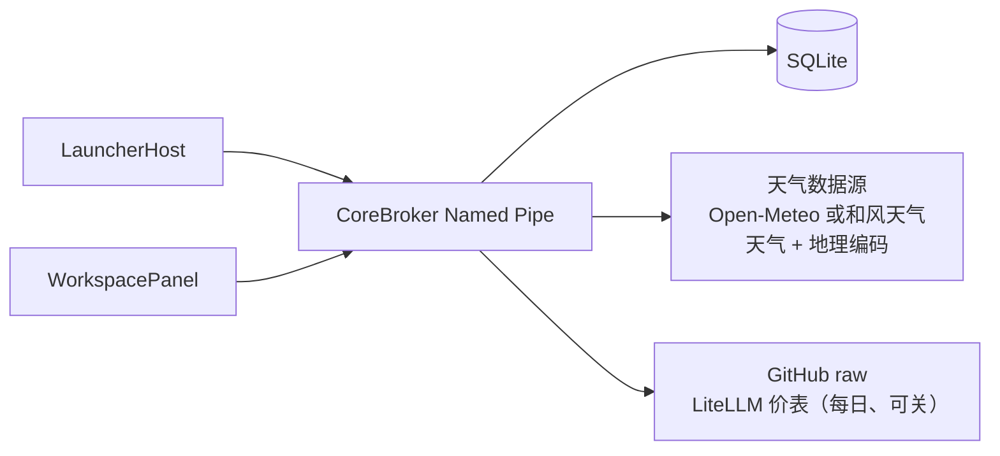

# 当前安全与隐私边界

文档状态：已批准
版本：0.6
日期：2026-09-10

## 1. 当前攻击面

轻量核心版只处理：

- LauncherHost 任务栏入口；
- WorkspacePanel 用户输入；
- 当前用户 Named Pipe；
- SQLite 中的布局、便签、天气位置与数据源选择、硬件监控显示项、Token 用量厂商设置与同步开关，以及过滤后的公开价表；
- SQLite 中经 DPAPI 加密的天气服务 API Key（见 §3.5）；
- 到当前天气数据源的天气请求与地点搜索：Open-Meteo（`api.open-meteo.com`、
  `geocoding-api.open-meteo.com`）或和风天气（用户账号自有的 `*.qweatherapi.com` 主机，见 §3.1、§3.5）；
- 到 `raw.githubusercontent.com` 的每日定价拉取（见 §3.4，用户可关）；
- 对本机会话转录的只读扫描（见 §3.2）；
- 本机硬件读数采样（仅公开用户态 API，不联网、不提权）；
- 对监控程序共享内存段的只读访问（HWiNFO、Core Temp，见 §3.3）；
- 本地日志和验收临时目录。

插件、剪贴板历史、云账号、日历同步、内核传感器驱动和自动更新不属于当前攻击面。本产品自身不分发也不加载任何内核驱动（[ADR-0029](adr/0029-drop-the-bundled-sensor-driver.md)）。

## 2. 必须保护的数据

- 便签标题和正文；
- 布局和卡片实例；
- 天气位置标签与坐标；
- 天气自动/手动定位模式与数据源选择；
- 天气服务 API Key（唯一的用户凭据，见 §3.5）；
- 用户在设置对话框中输入的地点搜索词；
- 本机会话转录（只读来源，内容绝不进入日志或存储，见 §3.2）；
- 硬件监控显示项与 Token 用量设置（厂商启用、定价同步开关）；
- IPC session token；
- 当前用户数据库和备份；
- 诊断日志中的系统信息。

天气数据本身不是秘密，但用户设置的位置可能具有隐私含义。

## 3. 信任边界

- LauncherHost 和 WorkspacePanel 是当前用户进程；
- CoreBroker 只接受当前用户连接和正确 session token；
- SQLite 是本地用户数据边界；
- Windows 位置服务是受系统隐私设置控制的 OS 信任边界，只由前台 WorkspacePanel 调用；
- 外部网络供应商有两类：天气数据源（用户二选一，各自提供天气读数与地点搜索两个端点）
  与 GitHub raw（LiteLLM 开源价表一个端点，§3.4）。同一时刻只有被选中的那一家会被访问。

## 3.1 地点搜索

设置天气位置时，用户输入的地名会发送到**当前天气数据源**的地理编码端点
（[ADR-0027](adr/0027-weather-location-search.md)、[ADR-0038](adr/0038-second-weather-provider-qweather.md)）：
Open-Meteo 时为 `geocoding-api.open-meteo.com`，和风天气时为该账号自有的 API 主机。
这是唯一会把用户输入的文本送出本机的路径，因此约束比天气读数更紧：

- 只在**用户提交搜索时**发生，不做按键即搜，也不在后台或按计划发生；
- 只发送搜索词本身，不带账号、设备标识、安装标识或既有位置；
- 查询 2～64 字符，响应上限 64 KiB，超时 8 秒；
- 搜索结果不缓存、不落盘、不进日志；落盘的仍然只有用户最终选定的标签与经纬度；
- 搜索词不写入任何日志或错误响应。

关闭设置对话框后，该端点不会再被访问。

## 3.2 会话转录只读面

Token 用量读取各工具的会话记录：`%USERPROFILE%\.claude\projects` 与
`%USERPROFILE%\.codex\sessions`（[ADR-0030](adr/0030-token-usage-card.md)）。
这是 CoreBroker 唯一读取自身数据库以外文件的路径，
而这些文件包含完整对话——源码、路径、可能的密钥片段——因此约束比任何其他读取都紧：

- 只读，绝不写入、移动或删除转录；
- 解析用 `Utf8JsonReader` 逐 token 走，`content` 数组按子树跳过，**消息正文不构造字符串、不进内存**；
- 每条记录只保留四项 token 计数、模型名、身份对和时间戳；
- 聚合结果**不写入 SQLite**，只存在于 broker 进程内，与天气读数一致；
  落盘的只有「启用了哪些厂商」这一项设置，不含任何用量数字；
- 配额只按厂商自己记录的数值原样显示，不估算、不查询、不外发；
- 解析失败只累加计数器，不记录任何来自对话的内容；
- 读取本身不产生任何网络流量；卡片唯一的网络活动是与用量无关、可关闭的定价拉取（§3.4），
  它是单向的，任何来自转录的数据都不会随它离开本机。

## 3.3 传感器共享内存只读面

温度与风扇没有任何用户态 API，读数来自用户已在运行的监控程序发布的共享内存段：
HWiNFO 的 `Global\HWiNFO_SENS_SM2`（[ADR-0033](adr/0033-hwinfo-shared-memory-sensor-source.md)）
与 Core Temp 的 `CoreTempMappingObjectEx`（[ADR-0034](adr/0034-core-temp-as-a-second-sensor-source.md)）。
这是 CoreBroker 唯一读取**另一个进程发布的数据**的路径，因此按不可信输入对待：

- 只读打开已存在的段，不创建、不写入、不安装、不启动、不提权；
- **命名空间只允许「全局优先、本地兜底」这一个方向**：会话本地命名空间任何进程都能创建同名段，
  而全局命名空间需要 `SeCreateGlobalPrivilege`。HWiNFO 发布在全局，因此只认全局；
  Core Temp 不带前缀发布（提权时落全局、否则落本地），因此两个名字都试且先试全局。
  反向回落（全局失败才用本地，或本地优先）等于给同会话的任意进程一个喂假读数的入口，不做；
- 签名、布局版本、两段各自的偏移／元素大小／元素个数逐项按映射长度校验，越界与溢出用 64 位运算挡住，
  任何一项不符即整体降级，不做部分解析，也不按块中的数字分配任何缓冲；
- 只取三个数值（两个温度、一个转速），不读取、不转发这些块中的其他内容；
  Core Temp 的块没有签名也没有时间戳，因此以核数／封装数是否描述得出一台真实机器作为完整性检查，
  并定时丢弃句柄重开——否则它退出后共享段会随我们持有的句柄一直留着，把最后一次读数冒充成实时值；
- 读数**不写入 SQLite**，只存在于 broker 进程内，与天气读数和 Token 用量一致；
- 不产生任何网络流量，源不在时静默降级。

## 3.4 定价同步

Token 用量的费用估算按公开价折算，价表每日从 LiteLLM 的开源价表条件拉取
（[ADR-0035](adr/0035-daily-token-pricing-sync.md)），端点固定为
`https://raw.githubusercontent.com/BerriAI/litellm/main/model_prices_and_context_window.json`：

- 单向 GET，请求只带 User-Agent 与上次的 `If-None-Match`，不带账号、设备、安装标识，
  更不带任何用量数字；
- 成功后 24 小时一次，失败后 1 小时重试；响应上限 8 MiB，超时 30 秒；
- 响应用 `Utf8JsonReader` 流式过滤到 Anthropic/OpenAI 的一方模型 id，其余供应商的条目既不进内存
  对象也不落盘；
- 落盘的只有过滤后的价格、ETag 与取回时间（`token_usage_pricing` 单行）；
- 设置页开关 `syncPricing` 默认开，关闭后 Broker 不再自发访问该端点、只用内置价表；开关旁的
  「立即同步」是一次显式动作（`tokenusage.pricing.sync`），点击才发起同一条 GET，不受开关约束；
- 失败不通知用户，只计数供诊断，价格退回上一次成功的结果或内置表。

## 3.5 天气服务凭据

和风天气数据源需要账号（[ADR-0038](adr/0038-second-weather-provider-qweather.md)）。
这是本产品持有的**唯一一份用户凭据**，因此边界写死在代码里而不是留给配置：

- API Key 经 **DPAPI（当前用户作用域）加密**后以 base64 文本存入 SQLite；
  数据库文件被拷到其他账户或机器时解密失败，此时**视为没有凭据**，而不是报存储错误；
- Key 只出现在请求头 `X-QW-Api-Key` 上，**绝不进 URL、请求键、日志或错误文本**；
  该请求头挂在单条请求消息上，不挂在共享 `HttpClient` 的默认头上，
  因此不会随无凭据的 Open-Meteo 流量一起发出；
- Key **只写不读**：任何 IPC 响应只回 `hasApiCredential` 布尔值，从不回显；
  设置对话框用 `PasswordBox` 采集，保存后立即清空；
- 允许接收 Key 的主机限定在 `*.qweatherapi.com` 与 `*.qweather.com` 之下。
  Key 是 bearer 凭据，它被发往哪个主机属于安全边界：粘贴错或被诱导填入的第三方主机不可达，
  带路径、端口或 userinfo 的地址一律拒绝；
- 缺 Host 或缺 Key 时不发任何网络请求，直接报缺凭据，**不回退到另一个数据源**。

## 4. Explorer 与权限

- 禁止注入、Hook 或依赖 Explorer 私有视觉树；
- 入口几何不确定时 fail closed；
- 基础应用不请求管理员权限；
- 不增加常驻提权服务；
- 不通过关闭系统安全功能换取兼容性。

## 5. IPC

- 只允许当前用户访问；
- 握手前拒绝业务方法；
- token 只经进程环境块传递，不出现在命令行，也不写日志；
- 4 字节长度帧在分配前检查 0 和 1 MiB 上限；
- 验证协议、方法、枚举、ID、字符串长度、时间戳和数值范围；
- 写操作使用 operation ID 与 revision；
- 事件队列有界，慢客户端断开；
- 错误响应不包含便签正文、token 或完整本地路径。

## 6. 本地数据

- WorkspacePanel 不直接连接数据库；
- CoreBroker 使用参数化 SQLite 访问；
- migration 在事务中执行；
- 破坏性迁移前具备备份恢复路径；
- revision 冲突不得静默覆盖；
- 数据库、WAL、备份和验收数据库不得提交 Git；
- 验收数据只位于系统临时目录的严格子目录。

## 7. 便签

- 正文不进入普通日志、错误详情或遥测；
- 当前没有云同步；
- 删除使用 revision 和明确确认；
- 保存失败保留内存草稿并显示失败；
- 不把便签内容自动复制到外部服务。

## 8. 天气

- 天气读数只连接**当前数据源**：Open-Meteo 时为 `https://api.open-meteo.com`，
  和风天气时为该账号自有的 API 主机；地点搜索只连接同一家的地理编码端点，
  且只在用户提交搜索时（约束见 §3.1、§3.5）；
- 使用系统 TLS 证书验证；
- 响应大小限制为 64 KiB；
- Scheduler deadline 为 10 秒；
- 只发送位置标签、纬度、经度、单位和必要天气字段；
- 不发送账号、设备标识或便签内容；
- 首次正常打开面板时在前台 UI 线程调用 Windows `Geolocator.RequestAccessAsync`；
- 只在自动模式的应用冷启动读取一次位置，不持续跟踪、不在 LauncherHost 或 CoreBroker 中定位；
- 拒绝、系统定位关闭或无数据时不改现有坐标；设置提供 Windows 位置隐私页入口；
- SQLite 只保存自动/手动模式和最终坐标，不保存 Windows 权限结果、定位精度或定位历史；
- 天气 payload 不写入 SQLite；
- 位置设置本地持久化并受 revision 保护；
- 日志不得记录完整请求 URL 中的精确坐标。

## 9. 日志

禁止记录：

- session token；
- 便签正文；
- 完整数据库内容；
- 精确天气坐标；
- 用户秘密和凭据；
- 会话记录的任何内容，含文件路径、模型名以外的字段和解析失败的原文；
- 不必要的完整文件路径。

日志必须有容量上限。当前不建立远程日志或遥测平台。

## 10. 验收与清理

- 真实 UIA 使用独立实例和临时数据库；
- 脚本只终止自己启动的进程；
- 删除临时目录前验证路径位于系统临时目录；
- 构建和缓存清理不得指向仓库根、用户目录或未解析变量；
- 生产数据只允许只读复核，不作为测试夹具。

## 11. 延期安全设计

以下旧提案不构成当前实现承诺：

- 第三方插件 sandbox；
- 插件权限 UI；
- 剪贴板敏感识别；
- OAuth 和 Credential Manager；
- 高级硬件 helper；
- 更新签名和企业供应链。

若重新启用，必须先新增产品范围和安全 ADR，再实现真实边界。

## 12. 风险分级验证

日常修改只验证受影响边界：

- IPC：非法输入、未授权、超限和幂等；
- SQLite：迁移、冲突、失败恢复；
- 天气：超时、超限、无效响应和隐私字段；
- UIA：验收数据隔离。

完整安全审查、供应链、签名和发布检查只在发布候选阶段执行。安全输入验证和用户数据保护不因轻量策略而降低。
