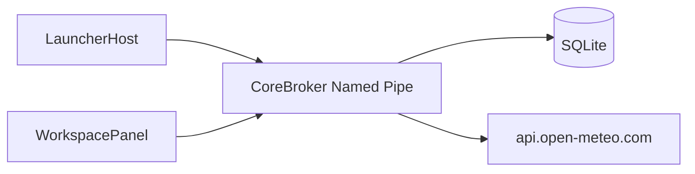

# 当前安全与隐私边界

文档状态：已批准
版本：0.2
日期：2026-08-15

## 1. 当前攻击面

轻量核心版只处理：

- LauncherHost 任务栏入口；
- WorkspacePanel 用户输入；
- 当前用户 Named Pipe；
- SQLite 中的布局、便签和天气位置；
- 到 `api.open-meteo.com` 的天气请求；
- 本地日志和验收临时目录。

插件、剪贴板历史、云账号、日历同步、硬件服务和自动更新不属于当前攻击面。

## 2. 必须保护的数据

- 便签标题和正文；
- 布局和卡片实例；
- 天气位置标签与坐标；
- 用户在设置对话框中输入的地点搜索词；
- IPC session token；
- 当前用户数据库和备份；
- 诊断日志中的系统信息。

天气数据本身不是秘密，但用户设置的位置可能具有隐私含义。

## 3. 信任边界

- LauncherHost 和 WorkspacePanel 是当前用户进程；
- CoreBroker 只接受当前用户连接和正确 session token；
- SQLite 是本地用户数据边界；
- Open-Meteo 是唯一的外部网络供应商，占两个端点：天气读数与地点搜索。

## 3.1 地点搜索

设置天气位置时，用户输入的地名会发送到 `geocoding-api.open-meteo.com`
（[ADR-0027](adr/0027-weather-location-search.md)）。这是唯一会把用户输入的文本送出本机的路径，
因此约束比天气读数更紧：

- 只在**用户提交搜索时**发生，不做按键即搜，也不在后台或按计划发生；
- 只发送搜索词本身，不带账号、设备标识、安装标识或既有位置；
- 查询 2～64 字符，响应上限 64 KiB，超时 8 秒；
- 搜索结果不缓存、不落盘、不进日志；落盘的仍然只有用户最终选定的标签与经纬度；
- 搜索词不写入任何日志或错误响应。

关闭设置对话框后，该端点不会再被访问。

## 4. Explorer 与权限

- 禁止注入、Hook 或依赖 Explorer 私有视觉树；
- 入口几何不确定时 fail closed；
- 基础应用不请求管理员权限；
- 不增加常驻提权服务；
- 不通过关闭系统安全功能换取兼容性。

## 5. IPC

- 只允许当前用户访问；
- 握手前拒绝业务方法；
- token 只经进程环境块传递，不出现在命令行，也不写日志；
- 4 字节长度帧在分配前检查 0 和 1 MiB 上限；
- 验证协议、方法、枚举、ID、字符串长度、时间戳和数值范围；
- 写操作使用 operation ID 与 revision；
- 事件队列有界，慢客户端断开；
- 错误响应不包含便签正文、token 或完整本地路径。

## 6. 本地数据

- WorkspacePanel 不直接连接数据库；
- CoreBroker 使用参数化 SQLite 访问；
- migration 在事务中执行；
- 破坏性迁移前具备备份恢复路径；
- revision 冲突不得静默覆盖；
- 数据库、WAL、备份和验收数据库不得提交 Git；
- 验收数据只位于系统临时目录的严格子目录。

## 7. 便签

- 正文不进入普通日志、错误详情或遥测；
- 当前没有云同步；
- 删除使用 revision 和明确确认；
- 保存失败保留内存草稿并显示失败；
- 不把便签内容自动复制到外部服务。

## 8. 天气

- 只连接 `https://api.open-meteo.com`；
- 使用系统 TLS 证书验证；
- 响应大小限制为 64 KiB；
- Scheduler deadline 为 10 秒；
- 只发送位置标签、纬度、经度、单位和必要天气字段；
- 不发送账号、设备标识或便签内容；
- 默认不调用 Windows 自动定位；
- 天气 payload 不写入 SQLite；
- 位置设置本地持久化并受 revision 保护；
- 日志不得记录完整请求 URL 中的精确坐标。

## 9. 日志

禁止记录：

- session token；
- 便签正文；
- 完整数据库内容；
- 精确天气坐标；
- 用户秘密和凭据；
- 不必要的完整文件路径。

日志必须有容量上限。当前不建立远程日志或遥测平台。

## 10. 验收与清理

- 真实 UIA 使用独立实例和临时数据库；
- 脚本只终止自己启动的进程；
- 删除临时目录前验证路径位于系统临时目录；
- 构建和缓存清理不得指向仓库根、用户目录或未解析变量；
- 生产数据只允许只读复核，不作为测试夹具。

## 11. 延期安全设计

以下旧提案不构成当前实现承诺：

- 第三方插件 sandbox；
- 插件权限 UI；
- 剪贴板敏感识别；
- OAuth 和 Credential Manager；
- 高级硬件 helper；
- 更新签名和企业供应链。

若重新启用，必须先新增产品范围和安全 ADR，再实现真实边界。

## 12. 风险分级验证

日常修改只验证受影响边界：

- IPC：非法输入、未授权、超限和幂等；
- SQLite：迁移、冲突、失败恢复；
- 天气：超时、超限、无效响应和隐私字段；
- UIA：验收数据隔离。

完整安全审查、供应链、签名和发布检查只在发布候选阶段执行。安全输入验证和用户数据保护不因轻量策略而降低。
