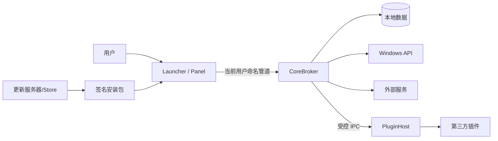

# 安全与隐私威胁模型

文档状态：已批准基线
版本：0.1
日期：2026-08-06

## 1. 安全目标

- 保护便签、待办、日历、剪贴板和账号令牌；
- 不因任务栏入口破坏 Explorer 或系统输入；
- 不因插件损坏核心进程；
- 防止未授权本地进程控制面板或读取状态；
- 保证更新、插件包和数据迁移可验证；
- 让用户清楚知道何时联网、读取剪贴板或访问账号；
- 基础功能不需要管理员权限。

## 2. 非安全目标与诚实边界

- 当前用户已运行的恶意高权限进程不在完整防御范围内；
- Job Object 提供可靠性和资源限制，不提供文件/网络安全隔离；
- fullTrust 插件拥有当前用户权限，权限清单只能告知，不能阻止其绕过 Broker；
- 无法可靠判断每条剪贴板内容是否来自密码管理器；
- 不承诺阻止屏幕截图或物理访问；
- 不把进程分离等同于沙箱。

## 3. 受保护资产

| 资产 | 敏感度 | 说明 |
| --- | --- | --- |
| OAuth token | 极高 | 可访问日历、待办 |
| 插件 API key | 极高 | 外部服务凭据 |
| 剪贴板正文/图片 | 极高 | 可能包含密码、令牌、私人内容 |
| 便签 | 高 | 私人或工作内容 |
| 日历/待办 | 高 | 行程与工作信息 |
| 本地数据库 | 高 | 聚合用户内容 |
| 布局和设置 | 中 | 用户习惯与设备信息 |
| 硬件传感器 | 中 | 设备指纹可能性 |
| 日志/诊断 | 中～高 | 路径、账号、状态 |
| 更新通道 | 极高 | 代码执行供应链 |
| 插件安装 | 极高 | 第三方代码执行 |

## 4. 信任边界



边界：

1. 用户输入到 UI；
2. UI 进程到 Broker；
3. Broker 到数据库/凭据；
4. Broker 到网络；
5. Broker 到插件；
6. 更新源到本地执行文件。

## 5. 威胁清单

### 5.1 Spoofing

威胁：

- 其他本地进程连接命名管道并发送命令；
- 恶意程序伪造 WorkspacePanel；
- 插件伪造另一个插件 ID；
- 伪造更新服务器或包。

控制：

- Pipe ACL 限定当前用户；
- 握手 token；
- 每连接固定 clientType；
- 插件包 ID 与签名/哈希绑定；
- TLS 系统验证；
- 更新包代码签名；
- 不在日志输出 token。

### 5.2 Tampering

威胁：

- 修改数据库、配置、Boot Snapshot；
- 修改插件 manifest；
- IPC frame 注入；
- 更新包替换；
- 路径遍历写入任意文件。

控制：

- 数据库事务与 migration；
- 原子 JSON 和上一版本；
- Schema/值域验证；
- 插件包哈希；
- 签名更新；
- 归档解压规范化路径并限制根目录；
- 不信任客户端传入的文件路径。

### 5.3 Repudiation

威胁：

- 插件执行外部动作后无法定位；
- 数据删除来源不清；
- 同步冲突覆盖无记录。

控制：

- correlation ID；
- 本地操作审计只记录动作类型和时间，不记录敏感正文；
- destructive action 记录来源；
- 同步保留 etag、revision 和 tombstone；
- 用户可查看最近账号/插件访问。

### 5.4 Information Disclosure

威胁：

- 剪贴板进入日志、数据库、诊断包；
- OAuth token 明文；
- 插件读取未授权数据；
- UI 缓存残留敏感图片；
- 崩溃转储包含正文；
- 网络请求发送多余字段。

控制：

- 剪贴板默认内存态；
- Credential Manager/DPAPI；
- Broker 最小数据；
- 缩略图缓存短期和可清理；
- 正式版默认不自动收集完整 dump；
- 诊断包发送前预览；
- 日志脱敏；
- Provider 请求字段最小化。

### 5.5 Denial of Service

威胁：

- 插件事件洪泛；
- 超大 JSON/UI Schema；
- Provider 高频轮询；
- 数据库锁；
- 图片炸弹；
- Explorer 恢复循环；
- Panel 崩溃循环。

控制：

- 消息上限；
- 队列上限和背压；
- 调度器限频；
- timeout/退避；
- 图片尺寸、像素和解码限制；
- 最大重启频率；
- 连续崩溃禁用；
- safe mode。

### 5.6 Elevation of Privilege

威胁：

- 基础应用请求管理员权限；
- 高级硬件 Helper 暴露任意 IO；
- 插件利用 Broker 执行任意进程；
- 路径参数导致高权限写入。

控制：

- 基础进程标准用户；
- Helper 独立可选、只读白名单协议；
- Pipe ACL 和调用方验证；
- 不提供通用 shell/command capability；
- `process.launch` 仅允许用户配置的白名单动作；
- Helper 安全评审和签名。

## 6. 剪贴板专项

### 6.1 原则

- 剪贴板是最高敏感等级；
- 用户启用前不读取历史；
- 不自行永久复制系统历史；
- 卡片关闭不等于权限撤回，但面板关闭应停止缩略图工作；
- 暂停入口必须显眼。

### 6.2 内容处理

文本：

- 长度上限；
- UI 默认显示有限行；
- 复制操作由用户触发；
- 日志只记录格式和长度。

图片：

- 检查像素尺寸和编码大小；
- 后台解码；
- 生成低分辨率缩略图；
- 缓存 TTL；
- 退出或清理时删除。

文件：

- 不自动打开；
- 不递归扫描目录；
- 不读取文件内容；
- 显示经过规范化的名称；
- 拖出前重新确认路径存在。

### 6.3 敏感识别

可以提供启发式遮罩，但不得宣称能识别全部密码或令牌。来源进程黑名单不是安全边界，因为剪贴板所有者和来源可能变化或不可用。

默认策略：

- 文本先显示一行；
- 看似密钥/密码的内容自动遮罩；
- 用户点击后临时揭示；
- 锁屏时清除内存预览；
- 诊断导出排除正文。

## 7. 插件专项

### 7.1 安全等级

#### builtin

- 随产品编译；
- 项目审核；
- 可使用原生 UI；
- 仍通过服务接口访问敏感数据。

#### brokered

- 必须存在真实沙箱；
- 只能调用宿主 capability；
- 网络由 Broker 代理并限制域名；
- 文件通过 picker token 或 broker handle；
- UI 使用声明式 Schema；
- 默认推荐级别。

#### fullTrust

- 当前用户权限；
- 可绕过权限代理直接访问 OS；
- 安装时必须显示明确风险；
- 不进入自动推荐；
- 崩溃仍与核心隔离；
- 企业策略可全面禁用。

### 7.2 安装

- 防 zip slip；
- 检查压缩比和解压总大小；
- 禁止符号链接逃逸；
- manifest 先验证；
- 哈希；
- 许可证和作者；
- 权限 diff；
- 更新插件时重新展示新增权限；
- 删除插件时询问数据处理。

### 7.3 运行

- 每插件独立身份；
- 消息大小和速率；
- action allowlist；
- network allowlist；
- timeout；
- crash loop；
- 资源配额；
- 禁止插件发送任意 XAML；
- URI 使用允许协议。

### 7.4 插件发布门禁

第三方安装功能只有在以下条件完成后可进入稳定版：

- 沙箱方案 ADR；
- 安全评审；
- 权限绕过测试；
- 包解析 fuzz；
- UI Schema fuzz；
- 插件更新与回滚；
- fullTrust 警告用户测试；
- 漏洞报告渠道。

## 8. IPC 安全

- Pipe 名包含用户/会话随机部分，不只使用固定公开名称；
- ACL 使用当前用户 SID；
- 服务端检查连接客户端进程和会话；
- session token 有生命周期；
- token 不作为唯一 ACL；
- frame 长度先验证；
- JSON 最大深度；
- 枚举和值域；
- 请求 deadline；
- action capability；
- idempotency；
- 断开后取消；
- 错误不回显秘密。

LauncherHost 只被允许：

- 注册入口；
- 获取有限徽标状态；
- 请求打开/关闭 Panel；
- 报告显示环境；
- 请求退出自身。

LauncherHost 不得查询便签、剪贴板或账号内容。

## 9. 本地存储

### 9.1 权限

- 数据目录仅当前用户；
- 不放在公共目录；
- 插件不能直接获得主数据库路径；
- 插件数据按 ID 分区；
- 导出使用用户选择路径。

### 9.2 数据库

- 参数化 SQL；
- migration hash/version；
- 备份；
- 不执行数据库内脚本；
- 导入时验证 schema；
- 恢复只从本应用备份格式；
- 数据删除有明确范围。

### 9.3 凭据

- token 仅 Credential Manager；
- 数据库保存 credential reference；
- 解绑删除 credential；
- 日志过滤 Authorization header；
- 内存对象尽快释放，不能保证完全清零时应诚实记录。

## 10. 网络

- 核心本地卡片不联网；
- 每个 Provider 独立 HttpClient/策略；
- 只使用 HTTPS，除非本地开发显式配置；
- 系统证书验证；
- 不忽略证书错误；
- User-Agent 标识应用版本；
- 请求最小化；
- 超时；
- 重试只适用于安全幂等请求；
- 429 尊重 Retry-After；
- 缓存不保存敏感响应到公共目录；
- 隐私页展示 Provider 域名。

天气自动定位需要单独权限；手动城市不应发送 Windows 账号或设备标识。

## 11. 更新供应链

- 正式二进制签名；
- 包签名和 publisher 验证；
- 更新 manifest 使用 HTTPS；
- 版本和架构匹配；
- 防降级；
- 更新前验证磁盘空间；
- 更新失败不删除旧可用版本；
- 数据迁移可恢复；
- 插件与主程序更新分离；
- 依赖 SBOM/Notice；
- 构建尽量可重复。

不允许从 README、gist 或插件返回内容中执行任意更新命令。

## 12. 高级硬件 Helper

若实现：

- 单独安装；
- 只读；
- 明确支持的传感器命令；
- 不允许任意 MSR、PCI、IO 读写；
- 请求者身份验证；
- 响应大小和频率限制；
- 服务端验证传感器 ID；
- 无通用文件或进程接口；
- 代码签名；
- 安全审计；
- 默认不安装。

如果第三方硬件库需要内核驱动，必须独立评估签名、漏洞历史、更新和卸载。

## 13. 日志与崩溃

### 13.1 禁止日志字段

- 剪贴板正文；
- 便签正文；
- 待办正文；
- 日历详情；
- OAuth token；
- API key；
- Cookie；
- Authorization；
- session token；
- 完整邮箱；
- 无必要的完整路径。

### 13.2 崩溃

- 默认本地摘要；
- 完整 dump 由用户显式启用；
- 导出前提示 dump 可能含内存敏感内容；
- 不自动上传；
- dump 设置过期和清理；
- 插件 dump 与核心分开。

## 14. 隐私控制面板

至少展示：

- 当前启用的联网 Provider；
- 最近联网时间；
- 剪贴板状态；
- 已连接账号；
- 插件权限；
- 本地数据大小；
- 缓存大小；
- 日志状态；
- 删除模块数据；
- 导出数据；
- 暂停全部后台刷新。

用户撤销权限后，UI 必须更新为 PermissionRequired，不可继续使用缓存伪装授权仍有效。

## 15. 数据保留

建议默认：

| 数据 | 保留 |
| --- | --- |
| 便签/待办/本地日历 | 用户删除前 |
| 布局/设置 | 用户重置前 |
| 剪贴板正文 | 不持久化 |
| 图片缩略缓存 | 短 TTL、容量上限 |
| 天气缓存 | 最近有效响应、有限 TTL |
| 日志 | 滚动容量/天数上限 |
| 诊断包 | 用户导出位置，应用不自动保留副本 |
| OAuth token | 账号解绑前 |
| 插件数据 | 卸载时由用户选择 |

具体 TTL 在实现前进入设置与隐私评审。

## 16. 安全测试门禁

- [ ] Pipe ACL 和客户端身份测试。
- [ ] Frame/JSON fuzz。
- [ ] 路径遍历和归档炸弹。
- [ ] UI Schema 深度、节点、URI。
- [ ] action 越权。
- [ ] 剪贴板不持久化断言。
- [ ] 日志敏感字段扫描。
- [ ] 诊断包敏感字段扫描。
- [ ] Credential Manager 引用验证。
- [ ] 更新签名。
- [ ] 数据库 migration 回滚。
- [ ] fullTrust 插件明确警告。
- [ ] 高级 Helper 最小接口审查。

任何 P0/P1 安全问题阻止发布。

## 17. 隐私验收

用户在以下配置下必须能使用核心功能：

```text
无 Microsoft 账号
无 Google 账号
无定位
无剪贴板历史
无管理员权限
无第三方插件
无遥测
断网
```

此时便签、计时器、本地待办、本地日历、基础布局和设置必须正常工作。
